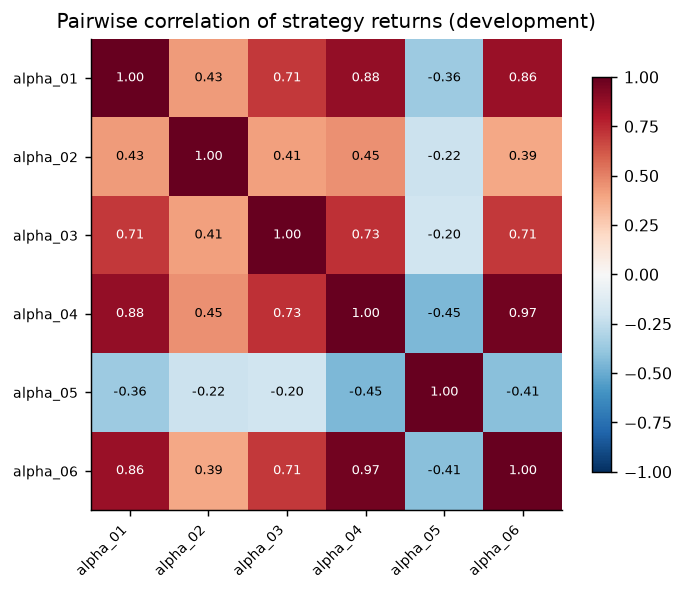
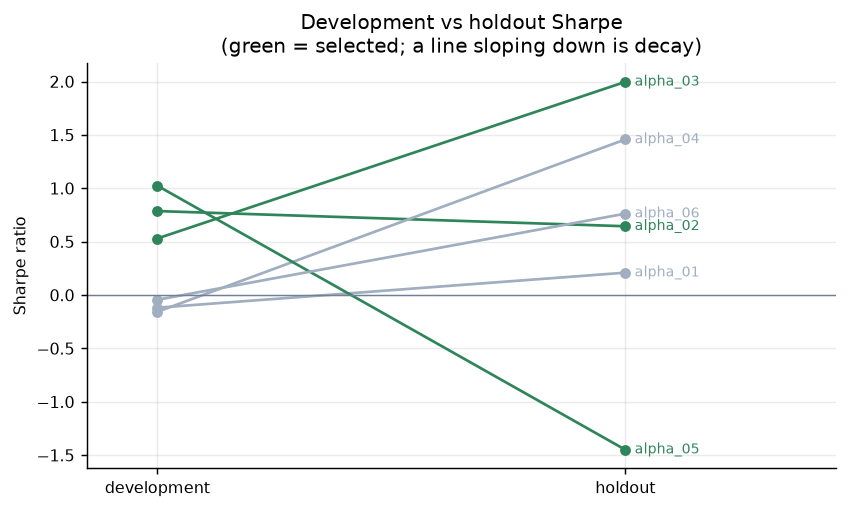
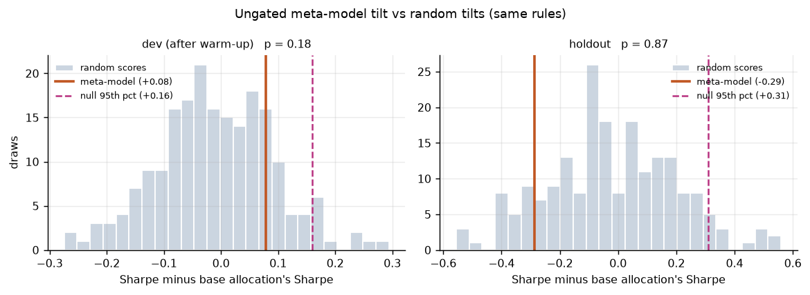
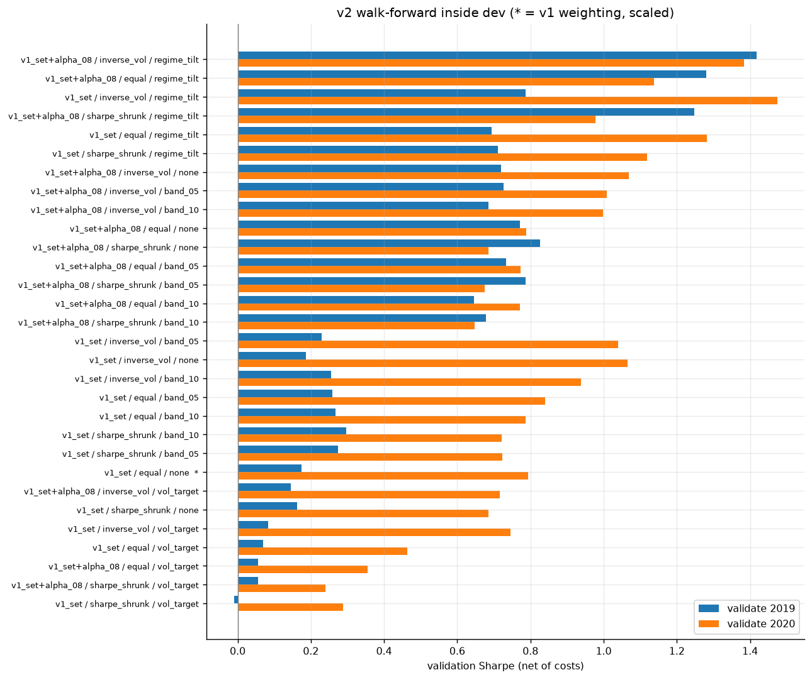
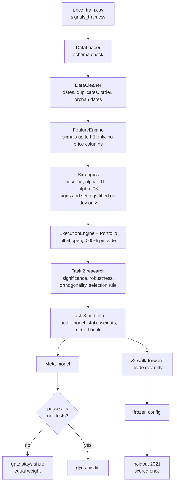

# Quant Alpha Lab

[](https://github.com/5upernova4/quant-alpha-lab/actions/workflows/ci.yml)

A research pipeline for finding, testing and combining trading signals on one
instrument, built for the Inter-IIT Tech Meet quant prepathon. It cleans a
deliberately broken dataset, finds that the instrument's "trend" signals
actually work backwards, builds eight strategies around that, and combines
them into a portfolio. Each step is checked for look-ahead, overfitting and
cost sensitivity. The rule throughout is that a validated small result beats
an unvalidated large one, and the README reports the failures alongside the
wins.

Akshat Agrawal, IIT (BHU) Varanasi

## Results

The submitted book (**v1**) is an equal-weight mix of four strategies. After
the competition I tried to improve it (**v2**): a new strategy, different
weights, a volatility-regime overlay, all chosen by walk-forward on the
development window, frozen, then scored once on the 2021 holdout.

| | v1 as submitted | | v1 scaled to 10% vol | | v2 | | buy and hold | |
|---|---|---|---|---|---|---|---|---|
| | dev | holdout | dev | holdout | dev | holdout | dev | holdout |
| Annual return | 10.7% | 4.9% | 14.4% | **6.6%** | 18.6% | 4.6% | 9.7% | 2.0% |
| Sharpe | 1.40 | **1.59** | 1.41 | 1.58 | 1.86 | 1.37 | 0.62 | 0.28 |
| Max drawdown | -7.7% | -2.4% | -9.9% | -3.1% | -7.0% | -2.6% | -18.9% | -5.8% |
| Turnover (x/yr) | 32.6 | 35.2 | 42.5 | 46.9 | 49.7 | 30.0 | 0 | 0 |
| Hit rate | 46.7% | 49.8% | 46.7% | 49.8% | 46.6% | 48.4% | - | - |

Dev is 2018-2020 (770 days) and is in-sample for every book. The holdout is
Jan-Nov 2021 (216 days). Everything is net of 0.05% per side, with fills at
the next open. Hit rate counts days with a position.

- **v2 failed.** It won on dev and in both walk-forward years inside dev, but
  on the holdout it was slightly worse than v1 (Sharpe 1.37 vs 1.59; the gap
  is not significant, p = 0.45). I report it as a failed improvement and keep
  v1 as the reference book.
- **The return gain that held is scaling.** v1 used about a third of its
  position limit. Scaled to a 10% vol target fixed on dev, it kept its Sharpe
  and made 6.6% instead of 4.9% on the holdout. That is more risk, not more
  skill.
- **Uncertainty is wide.** 216 days is short: the bootstrap 95% interval for
  v1's holdout Sharpe runs from -0.4 to 3.6. Positions do beat shuffled
  positions (block-permutation p = 0.01).

Full write-up: [`reports/v2_improvements.md`](reports/v2_improvements.md).


## What the research found

**1. The data had four planted defects.** The price rows were shuffled, 27
dates were written DD-MM-YYYY among 973 ISO dates, 14 rows were exact
duplicates, and 14 dates had signals but no price. `data_cleaner.py` fixes
each one and says so in a data-quality report. Warm-up gaps are left empty,
never back-filled, because back-filling copies later values into earlier days.

**2. The trend signals work backwards.** When the trend flag PB01 says "trend
is up", the next 10 days return 76 bps *less* than when it is off. That holds
in every year, and on the development window alone (-80 bps). The naive rule
"hold while PB01 is on" loses 3.0% a year in an asset that rose 36%. So the
instrument mean-reverts over 5-10 days, and most of the strategies fade the
trend flags instead of following them.

**3. Six strategies, about two real directions.** Task 2 built six strategies,
each testing a separate idea. Their returns span only about two independent
directions (participation ratio 1.98). alpha_04 and alpha_06 are 0.97
correlated, and alpha_04 is 95% explained by the others.



**4. The best strategy on dev was the worst on the holdout.** alpha_05 passed
every significance test on dev (Sharpe 1.02) and lost on the holdout (-1.45).
It was chosen by a rule written before the holdout was opened, so it stayed
in the book, and the report shows that.



**5. The learned allocator didn't beat chance, so it is switched off.** Task 3
trained a ridge model to tilt weights between strategies. It did not beat a
shuffled-label null (p = 0.24), and its tilts were no better than random
tilts pushed through the same rules (p = 0.18 on dev, 0.87 on the holdout).
The allocator only lets the model move money when its out-of-sample record so far clears
a bar; that happened on 7 of 43 rebalances in dev and never in the holdout.
Equal weight is the recommendation.



**6. v2: short-term reversal doesn't work; the dev winner didn't hold.**
Fading yesterday's move lost money in every dev year, so the reversion is
slow, not overnight. Following yesterday's move works a little and became
alpha_08. The walk-forward then picked a volatility-regime tilt that had
paid in 2018-2020, when the book only made money in volatile markets. In
2021 most days were calm and the book made money in them too, so the tilt
cut size on the wrong days.



## How it fits together



Two things hold for every number in the repo:

- **No look-ahead.** A decision for day t sees signals up to day t-1 and no
  price columns. This is checked on every run, and a test confirms the check
  catches a deliberate leak. v2 adds a truncation test (cut the data, rebuild,
  positions before the cut must not change) and a one-day look-ahead test
  that should, and does, inflate the Sharpe (1.86 to 4.38).
- **Costs are always paid.** Every book, including the allocations, goes
  through the same engine as one netted account. The engine matches a literal
  per-candle loop to 7e-16.

## Run it

The data comes from the Inter-IIT Tech Meet quant prepathon and is not
included here. If you have it, put `price_train.csv` and `signals_train.csv`
in `data/`. If not, you can generate fake files with the same columns (and
the same four defects) to see the pipeline run. The numbers will mean nothing.

```bash
pip install -r requirements.txt

python tools/make_synthetic_data.py    # only if you don't have the real data

python main.py                         # Tasks 1-3 as submitted, ~90 s
python main.py --task 1                # or one task at a time; --quick for fewer resamples

python run_v2.py --stage dev           # v2 walk-forward and freeze (reads no 2021 data)
python run_v2.py --stage holdout       # the frozen v2 scored on 2021
python run_v2.py --stage posthoc       # why v2 did what it did

pip install pytest && pytest -q        # tests run on synthetic data, ~70 s
```

Runs are deterministic. With the real data, `main.py` rewrites the tables in
`results/` byte-for-byte. The two Task 1 tables that contain the daily price
series are not committed; they are created when you run it.

## Project structure

```
main.py                   Tasks 1-3, as submitted
run_v2.py                 v2 stages: dev, holdout, posthoc
config.py                 paths, the mandated cost, the dev/holdout split

  Task 1: data and backtesting
data_loader.py            load and check columns
data_cleaner.py           fix the four defects, write the data-quality report
feature_engine.py         decision frame; signals lagged a day, no prices
strategy.py               base class every strategy implements
execution_engine.py       fills at the open, costs, slippage, trade log
portfolio.py              positions, equity, P&L
performance.py            every metric
backtester.py             the loop, plus a check against a per-candle loop

  Task 2: research
alpha_research.py         the Task 2 pipeline and the selection rule
statistics.py             Newey-West, bootstrap, permutation, deflated Sharpe
robustness.py             sub-periods, regimes, costs, parameters, noise
orthogonality.py          correlation, QR, effective number of strategies

  Task 3: portfolio
factor_model.py           alpha vs market exposure
portfolio_optimizer.py    equal weight, inverse vol, risk parity, max Sharpe
meta_model.py             learned allocator and its null tests
dynamic_allocator.py      the gate, plus the random-tilt null
final_evaluation.py       the head-to-head comparison
portfolio_backtest.py     nets strategy positions into one book before costs
research_context.py       builds the data once and owns the split
plots.py                  figures

  v2 (after the competition)
v2_portfolio.py           candidate books, walk-forward, freeze, bias checks

strategies/               baseline, alpha_01 ... alpha_08
tools/                    synthetic data generator
tests/                    pipeline and v2 tests (synthetic data)
reports/                  the write-ups below
results/                  tables, figures and run logs (results/v2/ for v2)
data/                     not included, see "Run it"
```

## Reports

| | |
|---|---|
| [`reports/implementation_note.md`](reports/implementation_note.md) | Task 1: design, the data defects, integrity checks, the baseline |
| [`reports/task2_research_report.md`](reports/task2_research_report.md) | Task 2: six hypotheses, evidence, orthogonality, selection |
| [`reports/task3_research_report.md`](reports/task3_research_report.md) | Task 3: factor model, allocation methods, the learned allocator and its null tests |
| [`reports/v2_improvements.md`](reports/v2_improvements.md) | After the competition: what I tried, what held up, what failed |

## Limitations

- **One instrument, four years.** The holdout is 216 days, so every holdout
  Sharpe has a 95% confidence interval three to four units wide.
- **Turnover is high.** The books trade 30-50 times a year. At 4x the
  mandated cost the holdout Sharpe is about zero for v1 and v2.
- **The holdout isn't perfectly clean.** alpha_07 was written after the Task 2
  holdout had been seen (disclosed in the Task 3 report). I also knew v1's
  holdout numbers when I started v2. Both are kept mechanical and dev-only,
  but neither is a fresh test.
- **The signals are anonymous.** Their meanings come from the competition's
  short descriptions, so the economic stories behind the strategies can't be
  checked against the exact definitions.
- **Execution is simplified.** Fills at the open at 0.05% per side, no market
  impact. Slippage up to 10 bps per side is stress-tested, not modelled live.
- **Sizing from P&L.** The vol-target overlay and the Task 3 allocator size
  strategies from their own past returns. Strategies never see price; I read
  sizing from realised P&L as an allocation input, not a trading signal.

## AI use disclosure

I used AI tools to help refine the reports and code. My purpose was to learn from
the suggestions and strengthen my understanding of the methods and implementation,
not to just vibe code and submit.

## License

MIT, see [LICENSE](LICENSE).
