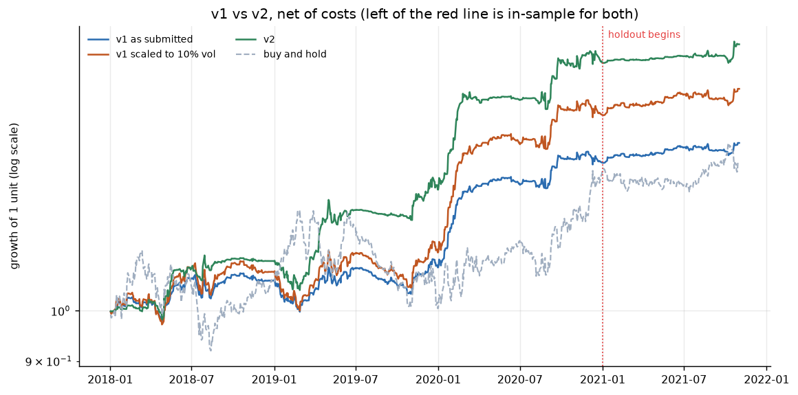

# v2: what I tried after the competition, and what held up

This is follow-up work, done after the prepathon was over. The submitted
pipeline (`main.py`) is unchanged and still reproduces every submitted table.
All v2 code is in `v2_portfolio.py`, `run_v2.py` and `strategies/alpha_08.py`,
and every number below comes from a file in `results/v2/`.

## Summary

- **v2 did not beat v1 on the holdout.** On the 2018-2020 development window
  v2 lifted the book's Sharpe from 1.40 to 1.86, and it also won both
  walk-forward validation years inside dev. On the 2021 holdout it made
  4.6%/yr at Sharpe 1.37, against 4.9%/yr at Sharpe 1.59 for v1 as submitted.
  The gap is not statistically significant (p = 0.45), but it is in the wrong
  direction, so I count v2 as a failed improvement.
- **The one return gain that held is scaling, and that is a risk choice, not
  skill.** v1 only used about a third of the position limit. Scaled to a 10%
  vol target (fixed on dev), it kept its Sharpe on the holdout (1.58) and made
  6.6%/yr instead of 4.9%/yr. Drawdowns grew by roughly the same 30%.
- **Fading yesterday's move does not work here.** Plain fading lost money in
  every dev year, and the two versions filtered by the trend flag lost in 5
  of 6 year-tests. At one day the move continues; the reversion this
  instrument is known for shows up over 5-10 days.
- **alpha_08 (next-day continuation) is small but held up.** Dev Sharpe 0.79,
  holdout 0.65. It is weak on its own and expensive to trade.
- **Recommendation: v1 stays the reference book.** If more return is wanted,
  scale v1 and accept the larger drawdowns that come with it.

## 1. Protocol, fixed before anything ran

| | |
|---|---|
| Development window | 2018-01-02 to 2020-12-31 (770 trading days) |
| Holdout | 2021-01-01 to 2021-11-01 (216 trading days) |
| Costs | 0.05% per side, fills at the open, signals lagged one day (same engine as v1) |
| Walk-forward | fold 1 fits on 2018 and validates on 2019; fold 2 fits on 2018-2019 and validates on 2020. Strategies are refitted in each fold. |
| Score | average validation Sharpe over the two folds |
| Rule | a configuration replaces "v1 set, equal weight, no overlay" only if it beats it in **both** folds |
| Freeze | the winner is refitted on all of dev and written to `results/v2/frozen_config.json` |

The frozen config was committed and pushed (commit `0e8e551`) before the
holdout stage was run. The holdout result is in the next commit (`913627e`).
The holdout stage re-derives the weights and scale from dev and refuses to run
if they differ from the frozen file.

**A caveat on the holdout.** The submission had already scored each v1
strategy on 2021, and I knew those numbers when I started v2 (for example
alpha_05's holdout Sharpe of -1.45). So 2021 is not fully fresh to me. I kept
every decision mechanical and dev-only (alpha_05 stays in every candidate
set, for instance), but a reader should know this.

## 2. Starting point: v1 reproduced

Re-running the copied code gives all 77 submitted tables byte-for-byte. v1 is
the equal-weight book of alpha_02, alpha_03, alpha_05 and alpha_07:

| v1 as submitted | dev | holdout |
|---|---|---|
| Annual return | 10.7% | 4.9% |
| Sharpe | 1.40 | 1.59 |
| Max drawdown | -7.7% | -2.4% |
| Turnover (x/yr) | 32.6 | 35.2 |
| Hit rate (days with a position) | 46.7% | 49.8% |

Its average absolute position on dev was 0.33, against a limit of 1.0, so it
ran at 7.5% vol when the instrument itself ran at 17.6%.

## 3. What I tried

### 3.1 Short-horizon reversal (failed on dev, never reached the holdout)

The obvious way to use "this instrument mean-reverts" is to fade yesterday's
move. The one-day change in PB07 tracks yesterday's return closely
(correlation 0.97 on dev), so this can be done with signals only. No fitting,
sign fixed (`results/v2/reversal_vs_continuation_dev.csv`):

| Rule | 2018 | 2019 | 2020 |
|---|---|---|---|
| Fade yesterday | -1.58 | -2.37 | -1.90 |
| Fade up-days only while PB01 is on | -0.09 | -0.75 | -1.55 |
| Fade down-days only while PB01 is off | -0.99 | -0.91 | +1.13 |
| Follow yesterday | +0.32 | +1.04 | +0.53 |

(Sharpe net of costs.) Plain fading loses even before costs, in every year.
Following yesterday's direction makes money before costs in every year
(Sharpe 0.95, 1.71, 1.22), but it trades ~230 times a year and costs take
about half of that. The reversion in this data lives
in the slower trend-state signals (5-10 days), not in one day's move.

### 3.2 alpha_08: next-day continuation (kept, weak)

`strategies/alpha_08.py` follows yesterday's direction. Its sign is fitted on
dev (it came out +1, t = 2.15), and fit() chooses whether to trade only when
BB07 (recent volatility) is above its trailing median. On dev the gate won
(Sharpe 0.80 vs 0.60 without it), which halves turnover.

| alpha_08, dev | |
|---|---|
| Sharpe / annual return | 0.79 / 11.1% |
| By year | 1.21, 1.00, 0.32 (falling) |
| Turnover, cost drag | 125x/yr, 6.3%/yr (over a third of gross) |
| Newey-West p | 0.16 |
| Block-permutation p | 0.006 |
| Deflated Sharpe probability (18 variants tried) | 0.18 |
| Break-even cost | 12.5 bps per side (2.5x the mandated cost) |
| Return correlation with the other v1 strategies (dev) | 0.04 (alpha_02), 0.00 (alpha_03), 0.28 (alpha_05), 0.09 (alpha_07) |
| Holdout Sharpe / return (post-hoc) | 0.65 / 3.3% |

So it times something (the permutation test), but after allowing for how many
variants I looked at, the evidence is thin. Its value is that it is close to
uncorrelated with the reversion strategies (it overlaps a little with
alpha_05, the other continuation idea).

### 3.3 Weighting

- **Equal weight**: the v1 choice.
- **Inverse volatility** (equal risk): each strategy's weight is 1/vol on the fit window.
- **Sharpe-weighted, shrunk**: half equal weight, half proportional to each
  strategy's fit-window Sharpe (negative Sharpes get zero). This is the simple
  stand-in for the learned meta-model, which stays gated off.

### 3.4 Overlays

- **Volatility-regime tilt**: book size x1.5 when BB07 is above its trailing
  126-day median, x0.5 otherwise. The idea is alpha_06's from Task 2:
  reversion pays more when volatility is high. Fixed parameters, nothing fitted.
- **Volatility targeting**: scale the book down when its own recent P&L vol is
  high (63-day window, lagged two days, at most 2x).
- **No-trade band** (0.05 or 0.10): only trade when the target moves past the
  band, and then only to the band edge. Aimed at turnover.

Before building the grid I also looked at a few other things on dev in-sample:
fixed leverage, EMA smoothing of the position, and more band widths. Smoothing
hurt badly (Sharpe 1.40 to 0.96 at a two-day half-life), because most of the
edge is gone within a day.

### 3.5 Scaling

Every configuration is scaled so its fit-window volatility is 10% a year
(capped at 4x, and the final position is still clipped to [-1, +1]). 10% is a
risk preference, about 60% of the instrument's own volatility. It is not
fitted. Since scaling leaves Sharpe nearly unchanged, Sharpe is the number to
judge skill by, and "v1 scaled to 10% vol" is reported as the control for
everything else.

### 3.6 Walk-forward results

30 configurations, validation Sharpe net of costs
(`results/v2/walk_forward_selection.csv`, `results/figures/fig_v2_walkforward.png`):

| Configuration | 2019 | 2020 | Mean |
|---|---|---|---|
| **v1 set + alpha_08 / inverse vol / regime tilt** (chosen) | 1.42 | 1.38 | 1.40 |
| v1 set + alpha_08 / equal / regime tilt | 1.28 | 1.14 | 1.21 |
| v1 set / inverse vol / regime tilt | 0.79 | 1.47 | 1.13 |
| v1 set + alpha_08 / inverse vol / none | 0.72 | 1.07 | 0.89 |
| v1 set + alpha_08 / equal / none | 0.77 | 0.79 | 0.78 |
| v1 set / equal / none (the default, scaled) | 0.17 | 0.79 | 0.48 |
| v1 as submitted (unscaled, for reference) | 0.20 | 0.77 | 0.49 |
| worst: v1 set / Sharpe-shrunk / vol targeting | -0.01 | 0.29 | 0.14 |

What the walk-forward said:

- Every regime-tilt configuration beat its no-overlay version in both years.
- Adding alpha_08 helped in most comparisons.
- **Volatility targeting was the worst overlay everywhere.** The book earns most
  when volatility is high, so cutting size then removes the best days.
- **No-trade bands made little difference.** They cut turnover, but the
  saving was about the same size as the edge they gave up: slightly better
  on the v1 set, slightly worse once alpha_08 (which has to trade daily) was
  in. At the mandated 5 bps there isn't much cost to save.
- Sharpe-weighting was slightly worse than equal weight in every pairing.
  Two or three years of Sharpe estimates are too noisy to weight on.

## 4. The frozen v2

From `results/v2/frozen_config.json`:

| | |
|---|---|
| Strategies | alpha_02, alpha_03, alpha_05, alpha_07, alpha_08 |
| Weights | 0.414, 0.147, 0.162, 0.138, 0.139 |
| Overlay | regime tilt (x1.5 / x0.5 on BB07) |
| Scale | 1.32 (gives 10% vol on dev) |

## 5. Bias checks (dev only)

| Check | Result |
|---|---|
| Truncation: cut the data at 5 dates, rebuild, compare positions before the cut | identical (max change 0) |
| One extra day of signal delay | Sharpe 1.86 to 1.04: degrades, as a short-lived edge should |
| One day of look-ahead on purpose | Sharpe jumps to 4.38: the harness would catch a leak |
| Deflated Sharpe of the dev result, as the best of ~60 book variants | 0.98 |
| alpha_08 sees only PB07 and BB07 | scrambling every other signal leaves its positions unchanged (test) |
| Price/volume columns refused | yes (same guard as every strategy) |

The usual project checks also still run: the t-1 information cutoff, the
price-column guard, and the engine-vs-per-candle-loop check.

The deflated Sharpe of 0.98 says the dev result is unlikely to be pure luck
from the search. It cannot say the dev pattern will persist, and in 2021 it
didn't.

## 6. Holdout result, run once

`results/v2/v1_vs_v2.csv`. "Hit rate" counts only days with a position.

| | v1 as submitted | | v1 scaled to 10% vol | | **v2** | | buy and hold | |
|---|---|---|---|---|---|---|---|---|
| | dev | holdout | dev | holdout | dev | holdout | dev | holdout |
| Annual return | 10.7% | 4.9% | 14.4% | **6.6%** | 18.6% | 4.6% | 9.7% | 2.0% |
| Volatility | 7.5% | 3.0% | 9.9% | 4.1% | 9.4% | 3.4% | 17.6% | 8.5% |
| Sharpe | 1.40 | **1.59** | 1.41 | 1.58 | 1.86 | 1.37 | 0.62 | 0.28 |
| Max drawdown | -7.7% | -2.4% | -9.9% | -3.1% | -7.0% | -2.6% | -18.9% | -5.8% |
| Turnover (x/yr) | 32.6 | 35.2 | 42.5 | 46.9 | 49.7 | 30.0 | 0 | 0 |
| Hit rate | 46.7% | 49.8% | 46.7% | 49.8% | 46.6% | 48.4% | - | - |

Dev columns are in-sample for every book (the strategies were fitted on dev).

Significance on the holdout (`results/v2/significance.csv`):

| | Newey-West t (p) | Bootstrap 95% CI for Sharpe | Block-permutation p | vs v1 scaled, same risk |
|---|---|---|---|---|
| v1 as submitted | 1.48 (0.14) | -0.36 to 3.61 | 0.010 | - |
| v1 scaled | 1.47 (0.14) | -0.38 to 3.61 | 0.010 | control |
| v2 | 1.16 (0.24) | -0.60 to 2.82 | 0.017 | -1.9%/yr, t = -0.76, p = 0.45 |

216 days is short. None of the books is significant on the holdout by
Newey-West, although all three time the market better than shuffled positions
would. Even on dev, v2's edge over v1 at the same risk was only t = 1.23
(p = 0.22).

Sharpe under higher costs (`results/v2/cost_stress.csv`):

| | 1x | 2x | 4x |
|---|---|---|---|
| v1, holdout | 1.59 | 1.01 | -0.14 |
| v2, holdout | 1.37 | 0.92 | 0.02 |

v2 traded less in 2021 than v1 (the tilt kept it small), so it held up
slightly better at 4x costs. That is a side effect, not something I aimed for.



## 7. Why v2 failed (post-hoc, explanation only)

These numbers were produced after the holdout result was known, by
`python run_v2.py --stage posthoc`. They explain the result. They do not
choose anything, and picking the best row of them would be choosing on the
holdout.

**The regime tilt bet on a pattern that changed.** On dev, the v1 book made all
of its money when BB07 was high (`results/v2/posthoc_regime_split.csv`):

| | share of days | v1 Sharpe on those days |
|---|---|---|
| dev, high vol | 51% | 2.68 |
| dev, low vol | 49% | -0.71 |
| 2021, high vol | 24% | 2.15 |
| 2021, low vol | 76% | 1.37 |

2021 was mostly calm, and in 2021 the book also made money in calm markets.
The tilt halved its size on three days out of four, including most of the
profitable ones. Every regime-tilt configuration did worse on the holdout
than the same configuration without it.

**Inverse-vol weighting leaned on the quietest strategy.** It put 41% in
alpha_02, which had a weak 2021 (Sharpe 0.64), and less in alpha_03 and
alpha_07, which had strong ones (2.00 and 1.80).

**alpha_08 roughly held up.** Holdout Sharpe 0.65 against 0.79 on dev.

The best holdout configuration in the post-hoc table is "v1 set + alpha_08,
equal weight, no overlay" (Sharpe 1.75). It is tempting to call that v2. I
won't: it was not the pre-registered choice, and choosing it now would be
tuning on the holdout. With no fresh data left, it stays an untested idea.

## 8. What I take from this

- A two-fold walk-forward inside three years is weak protection. Both folds
  shared the same regime structure, so the regime tilt looked validated when
  it was really one three-year pattern measured twice.
- This is the same lesson as alpha_05 in Task 2 (best on dev, worst on the
  holdout), one level up: this time it happened to the portfolio rule.
- The project's principle holds: a validated small result beats an
  unvalidated large one. v1's holdout Sharpe of 1.59 is the number I can
  stand behind. v2's dev Sharpe of 1.86 is not.
- The honest route to "more return" here is risk, not cleverness: scale the
  book. At a 10% vol target v1 made 14.4%/yr on dev and 6.6%/yr on the
  holdout, with drawdowns roughly 30% larger.

## 9. Reproduce

```bash
python run_v2.py --stage dev       # walk-forward, freeze, bias checks (reads no 2021 data)
python run_v2.py --stage holdout   # the frozen v2 on 2021
python run_v2.py --stage posthoc   # the explanation tables in section 7
```

Each stage takes a few seconds and is deterministic.
